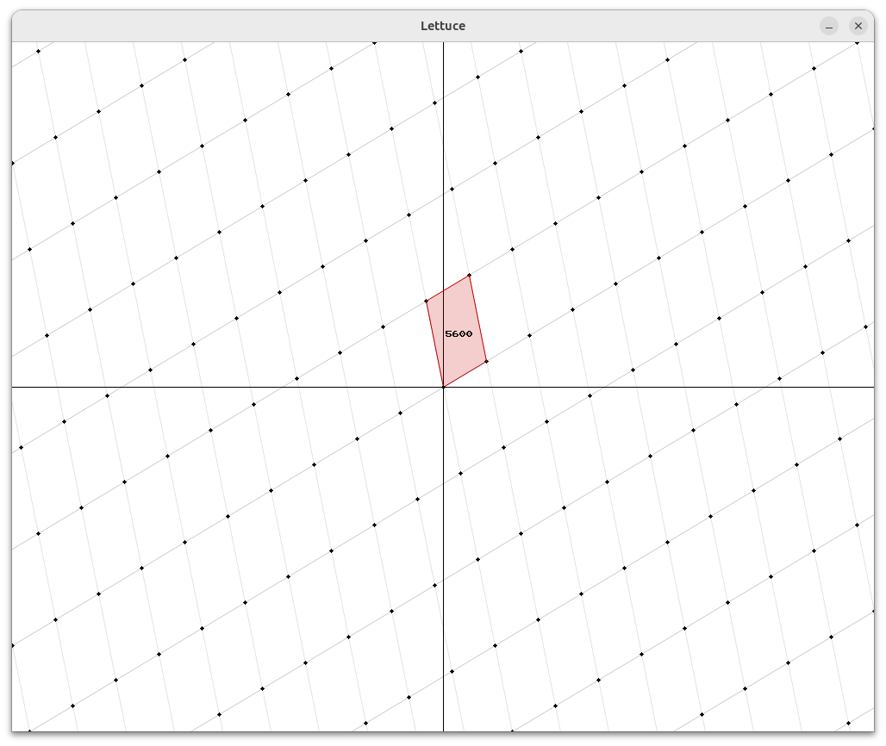

# lettuce
Lettuce is a lattice visualizer in $\mathbf{R}^2$ written with SDL3.
There exists controls for:
* Lattice reduction (R)
* Fundamental domain (F)
* Lattice points and showing fundamental domain offsets (H)
* CVP at mouse position (C)[^1]

[^1]: Unreliable. Majorly.

## Installation
```
chmod +x build.sh
./build.sh
```

## Demo

